# Road to Orbit 🚗 ✈️ 🚀

A 3D Android game where **one vehicle transforms three times**: you start as a race car, morph into an
airplane to climb above the clouds, then into a space rocket to reach another world – where the rocket lands and
turns back into a car for a victory drive. There are two levels: **the Moon** (from a mountain highway on Earth)
and **Mars** (across the red desert and through a dust storm to Phobos, with Mars filling the sky).

Everything you see and hear is generated in code: all 3D models, the sky, the terrain, every sound
effect and the music. There are no image, model or audio files in the app, and the only runtime dependency
is the Kotlin standard library (the whole APK is under 1 MB).

<table>
  <tr>
    <td>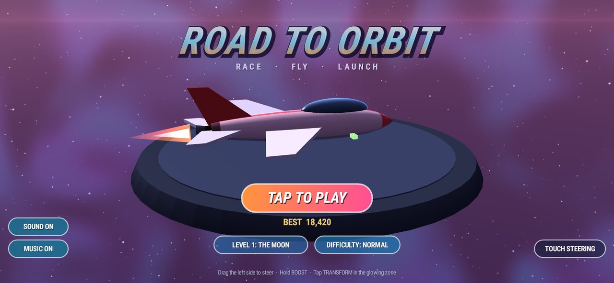<br><sub><b>Title screen</b> – the vehicle cycles through its three forms on the turntable</sub></td>
    <td>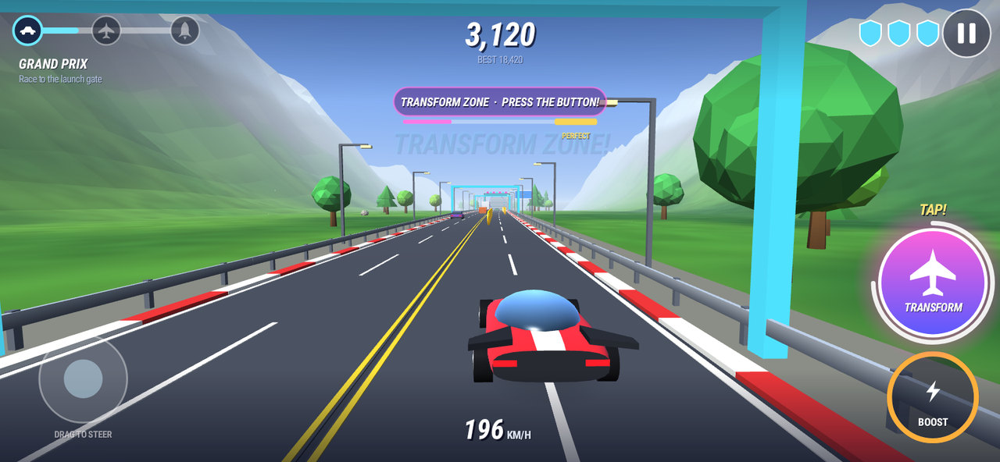<br><sub><b>1 · Grand Prix</b> – race to the glowing transform zone, then tap TRANSFORM</sub></td>
  </tr>
  <tr>
    <td>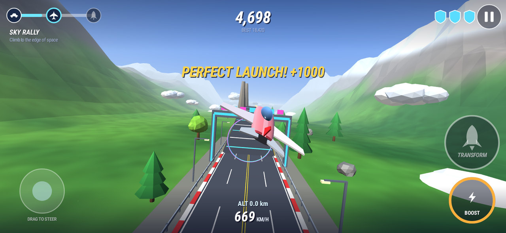<br><sub><b>Transformation #1</b> – car → airplane, launched off the gate (a PERFECT LAUNCH pays +1000)</sub></td>
    <td>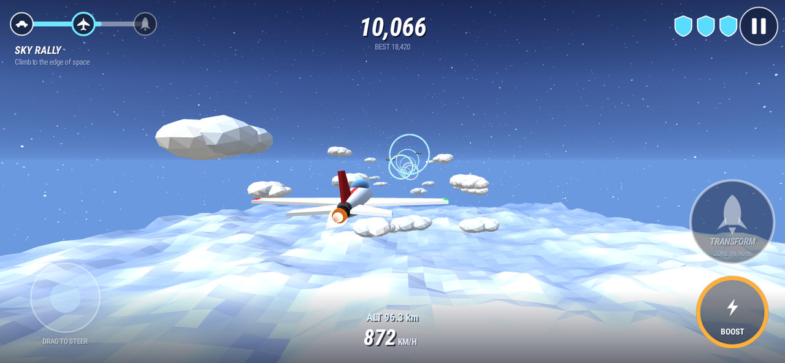<br><sub><b>2 · Sky Rally</b> – rings, balloons and storms above the cloud deck</sub></td>
  </tr>
  <tr>
    <td>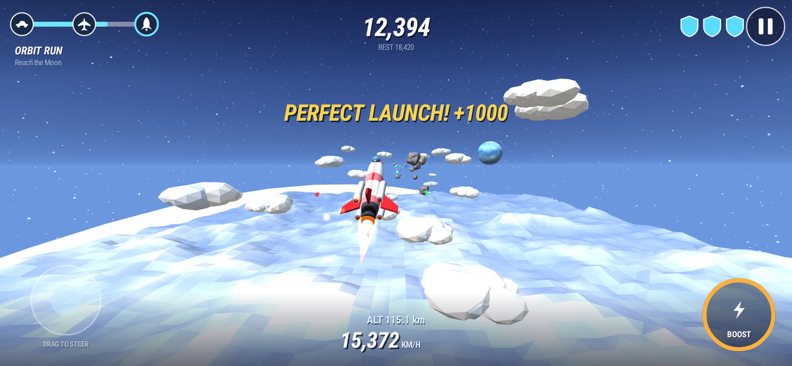<br><sub><b>Transformation #2</b> – airplane → rocket at the edge of space</sub></td>
    <td>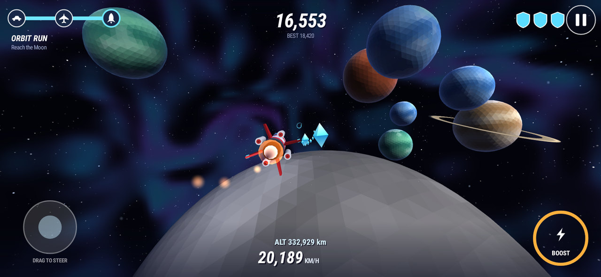<br><sub><b>3 · Orbit Run</b> – asteroids, crystals and planets on the way to the Moon</sub></td>
  </tr>
  <tr>
    <td>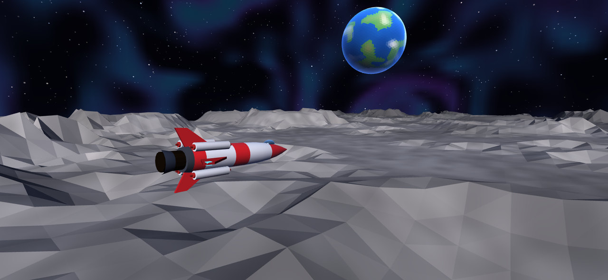<br><sub><b>Moon landing</b> – the rocket touches down…</sub></td>
    <td>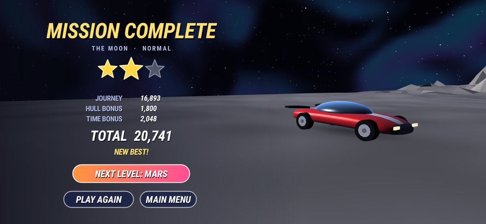<br><sub><b>Mission complete</b> – …and turns back into a car for the victory drive</sub></td>
  </tr>
</table>

**Level 2 · Mars**

<table>
  <tr>
    <td>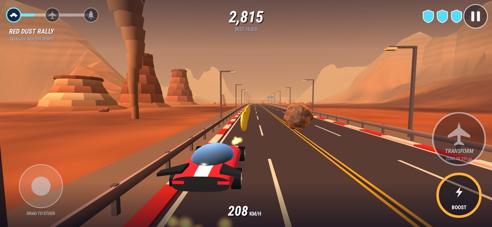<br><sub><b>1 · Red Dust Rally</b> – a Martian highway with colony traffic, mesas, dust devils and boulders that start to roll across the road</sub></td>
    <td>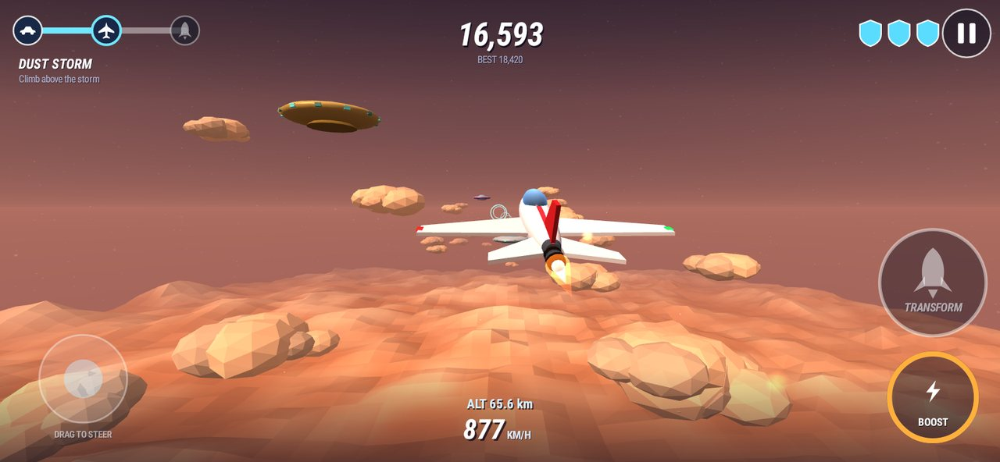<br><sub><b>2 · Dust Storm</b> – above the dust deck: rings, flying saucers, red hoodoos and storm cells</sub></td>
  </tr>
  <tr>
    <td>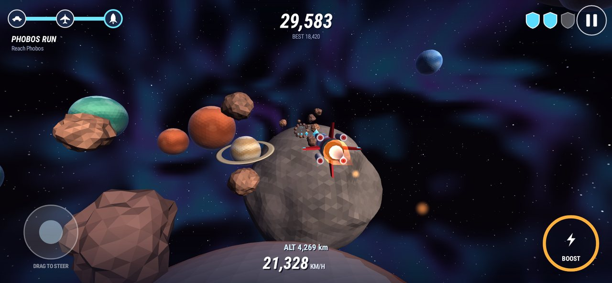<br><sub><b>3 · Phobos Run</b> – asteroids on the way to Mars' lumpy little moon</sub></td>
    <td>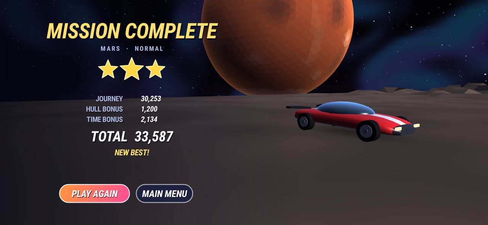<br><sub><b>Phobos landing</b> – the victory drive, with Mars filling the sky</sub></td>
  </tr>
</table>

<sub>These are headless renders of the real renderer and the real HUD code (see
[Testing without a device](#testing-without-a-device)), not captures from a phone.</sub>

## Install

Grab the APK from [`dist/road-to-orbit.apk`](dist/road-to-orbit.apk) (or from the *Actions → Build* run
artifacts) and install it on an Android 8.0+ phone (sideload: allow "install unknown apps" for your
browser/file manager). It needs OpenGL ES 3.0, which every phone from the last decade has. The game runs
in landscape.

## How to play

Pick the level with the **LEVEL** pill on the menu (or the L key / gamepad Y); after a win the results screen offers
**NEXT LEVEL**. Each level has three stages and you transform between them:

| Stage | You are | Level 1 · The Moon | Level 2 · Mars |
|---|---|---|---|
| 1 | a race car | **Grand Prix** – weave through traffic, barriers and cones, grab coins and nitro. | **Red Dust Rally** – the same on a Martian highway, with colony rovers and haulers for traffic and boulders that start to roll across the road as you approach: dodge them. |
| 2 | an airplane | **Sky Rally** – fly through glowing rings, dodge balloons, rock spires, storms and jets; climb to the edge of space. | **Dust Storm** – rings again, but the obstacles are flying saucers, red hoodoos, dust storms and colony shuttles. |
| 3 | a rocket | **Orbit Run** – thread asteroid fields, rings and meteor walls, collect crystals, reach the Moon. | **Phobos Run** – longer and faster; reach Phobos and land with Mars hanging in the sky. |

Mars is the longer, faster level and gets harder sooner.

* **Steer** – drag anywhere on the left half of the screen (a floating stick). Left/right in the car, left/right + up/down in the air and in space. Optional **tilt steering** on the menu: your attitude at GO is neutral (it follows your grip during the countdown, so settle in however you like); tilt the right edge down to steer right, the top edge toward you to climb. A finger on the stick always wins.
* **Boost** – hold the BOOST button. Nitro, orbs and crystals refill the meter.
* **Transform** – near the end of the first two stages a glowing **transform zone** opens (guide arches / portal rings). Tap **TRANSFORM** while inside it. Pressing within the last 70 m of the gate is a **PERFECT LAUNCH** (+1000). If you forget, the vehicle transforms automatically at the gate, so you can never get stuck.
* **Shields** – you have 3 per stage. A hit costs one and gives you a moment of invulnerability; wrenches repair. Lose all of them and you can retry the stage from its start.
* **Score** – distance, coins, rings (streaks pay extra), near misses and transformations, plus a hull bonus and a time bonus when you land. 1–3 stars; the best score is saved per level and difficulty.
* **Difficulty** – cycle EASY / NORMAL / HARD on the menu. Easy: 4 shields, wider gaps, a bit slower, ×0.8 points. Hard: 2 shields, tighter gaps, 10 % faster, ×1.4 points.
* **Sound and music** can be switched off separately on the menu. There are nine music loops: the menu, and a race, a flight, a space and a finale loop for each level (Mars is in another key and mood).
* **Keyboard / gamepad** also work: arrows or WASD (D-pad) steer, Shift / Space (R1, B) boost, T (X) transforms, Enter (A) starts, resumes or retries, L (Y) picks the level on the menu and goes on to the next one after a win, P / Esc (Start) pauses.

A full run takes about three minutes.

## Building

```bash
./gradlew :core:test :app:testDebugUnitTest   # game logic, bot playthroughs, renderer, audio synth, HUD tests
./gradlew :app:assembleRelease                # → app/build/outputs/apk/release/app-release.apk
./gradlew :app:installDebug                   # install on a connected device
```

Requirements: JDK 17+ and the Android SDK (platform 35). Open the folder in Android Studio and press ▶ to
run on a device or emulator. Builds are signed with the committed, intentionally public key in
`keystore/` so every build can be installed over the previous one (this is not a Play Store key).
The GitHub Actions workflow (`.github/workflows/android.yml`) runs the tests and uploads the APK on every push.

## How it is built

```
core/   pure Kotlin/JVM – no Android dependencies
  game/   deterministic simulation: levels and legs, spawner patterns, collisions, scoring, transformations, finale
  gfx/    OpenGL ES 3.0 renderer behind a tiny `Gles` interface, procedural meshes, shaders, camera
  audio/  procedural sound-effect and music synthesiser (22 kHz PCM)
app/    thin Android shell: GLSurfaceView, Canvas HUD/menus, touch/tilt/keyboard input, audio playback
tools/render-check/   headless screenshots of the renderer and the HUD (see below)
```

Some of the techniques:

* **The transformation** – the fuselage is one *lofted* mesh whose cross-section (a superellipse) blends
  between a boxy car body, a slim fuselage and a round rocket tube, while about 20 parts (wheels → booster
  pods, folded wings → fins, spoiler → tailplane …) glide between three key poses with staggered easing.
* **Curved world** – the world is dead straight, but every vertex is pushed sideways/down in proportion
  to the square of its view distance, so roads wind, hills roll and, at altitude, the horizon curves away.
* **Procedural terrain** – the vertex shader builds the whole ground grid from `gl_VertexID` and noise
  anchored to world coordinates (no vertex buffer, no swimming). The same shader blends land → cloud deck → moon dust;
  a world flag swaps the rolling green hills for terraced red mesas, the clouds for a dust deck and the Moon for Phobos.
* **Levels as data** – a level (`LevelSpec`) is its world, three legs, destination, difficulty curve and star scores; the
  simulation, spawner, renderer and HUD all read it, so the Moon and Mars share every line of game logic. Mars adds
  only skins (rovers, saucers, hoodoos, a second palette, its own music) and one new mechanic, the rolling boulders.
* **Procedural sky** – gradient, sun glow, two star layers and a nebula (baked once into a small cubemap),
  all looked up per pixel from the view direction; its palette slides from daylight to space with altitude.
* **Sound and music** – effects and engine loops are synthesised (additive tones, sweeps, filtered noise) and
  cached as WAVs on first launch; the engine pitch follows your speed. The nine music loops are rendered the
  same way (one at a time, when first needed) and played gaplessly through a static `AudioTrack`.
* **Frame budget** – meshes are built on a background thread while the menu is shown, the HUD reads an
  allocation-free state snapshot, and if frames stay slow the 3D resolution drops step by step (the HUD stays
  sharp, because it is a separate view).

### Testing without a device

* `core` has unit tests plus a **bot** that plays all three stages of both levels headlessly on several seeds, on every
  difficulty and with a human-like reaction delay, to prove the game is winnable and never produces NaNs.
  The renderer, the vehicle morph, the nebula cubemap, the audio synthesisers, and the Martian models (they must fit the
  collision boxes of what they replace) have tests too. `./gradlew :core:test --tests '*BalanceReportTest*' -Dbalance=1`
  prints how often skilled and human-like pilots win, lose shields and die on every level and difficulty (`core/build/balance.txt`).
* **Chaos tests** play the way real devices and thumbs do - random frame times and hitches, random steering and
  taps, restarts and retries at any moment, pauses, degenerate surface sizes, GL context loss - and render *every*
  frame through `StrictGles`, a GL implementation that validates each call like a strict driver (buffer positions
  and sizes, draws that read past a buffer, uniforms from the wrong program, non-finite numbers, leaked objects).
  `./gradlew :core:test -Dchaos=heavy` runs 120 sessions of 15,000 frames (about 1.8 million frames).
* **Memory budgets** fail the build if the heap grows over a long play session, if a frame allocates more than a
  few KB, or if start-up work (meshes, sound effects, one music loop) needs more than a fraction of what a phone allows.
* `app` has Robolectric tests that draw every HUD and menu screen to PNGs (`app/build/hud`), fuzz the HUD with random
  states and screen sizes and the touch handling with thousands of random multi-touch events (malformed sequences
  included), run the activity through random lifecycle changes, and drive the real audio engine frame by frame.
* `tools/render-check` records the *real renderer's* GL command stream to a trace and replays it in headless
  Chromium (WebGL2), which both compiles the GLSL ES 3.00 shaders in a real implementation and produces
  PNG frames of every stage. The real HUD is drawn on top, so the result is what a player sees:

  ```bash
  tools/render-check/screenshots.sh                  # the Moon → tools/render-check/out/shots/*.png (28 key moments)
  tools/render-check/screenshots.sh <outDir> 1       # level 2, Mars
  ```

  It needs Node with Playwright + Chromium and Python with Pillow. Under the hood it is
  `./gradlew :core:journeyTrace` (bot plays, GL trace + HUD snapshots are recorded), `render.mjs` (replay in
  Chromium), `HudOverlayTest` (HUD on transparent bitmaps) and `compose.py` (overlay). `RenderTraceTest`
  records showroom views of all three forms and of the stages of both transformations, from the front,
  side and rear, in the same way; `MeshGalleryTest` lays the Martian models out on the Martian ground.

## If something goes wrong

The game saves a small report when it crashes (and when it hits an error it can recover from by returning to the menu):
the stack trace, the device, the Java heap, a census of the threads and the last things the game did. The next launch shows
it with a **COPY REPORT** button and a **CONTINUE** button - paste the report into a bug report. If the game ever stops
with an error screen, that screen shows the same report. (Logcat has the full trace too: `adb logcat -s RoadToOrbit`.)

## Status

Developed and verified in a headless cloud environment: the code compiles, all tests pass (70 in `core`, 50 in `app`), Android
lint reports no errors (a few warnings, mostly the deliberate fixed-landscape, non-resizable activity), and the rendered frames
were inspected. The first run on a real phone found an out-of-memory crash (the music was re-requested on every frame in
the menu and on the results screens, each request synthesising a whole loop on a new thread); that is fixed and has regression
tests. The Mars level was added without touching the first one: the Moon's bot results and all of its rendered frames are
identical to before the change, and both levels pass the same chaos, memory and strict-GL tests. Things that only real hardware
can confirm: the frame rate on actual GPUs (software GL was used to render the frames), tilt steering, touch feel, how the
synthesised audio sounds (it was checked numerically and as spectrograms, not by ear), and how hard Mars feels to people (its
difficulty was measured with test pilots, see `BalanceReportTest`, not with people).
